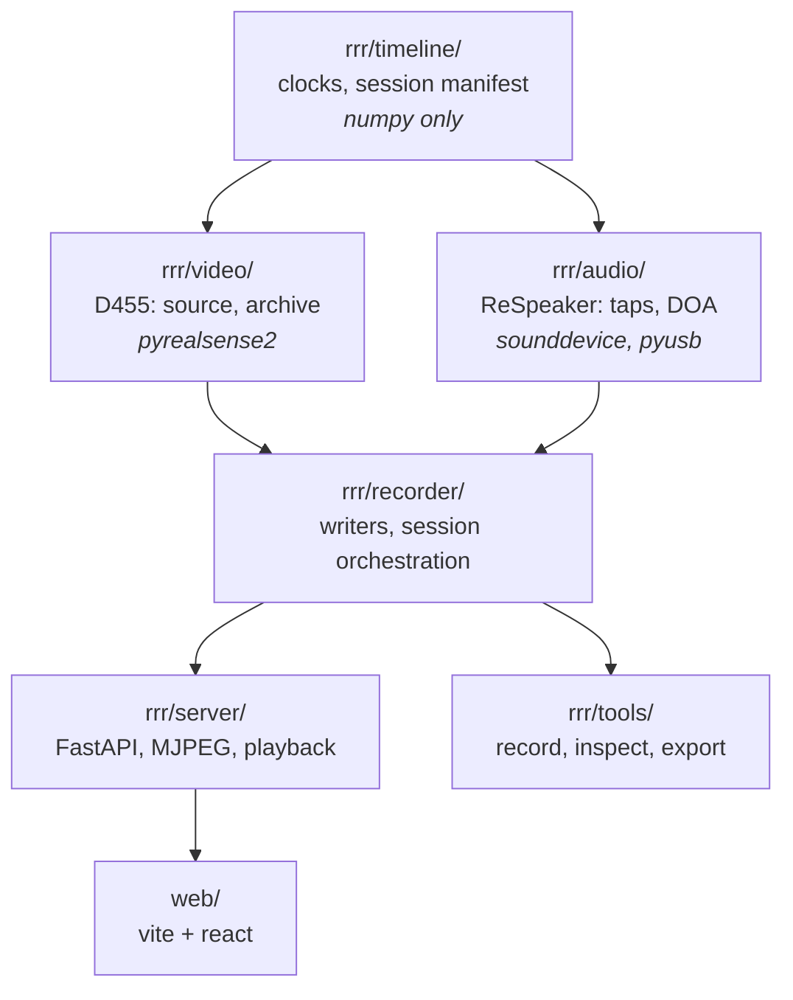
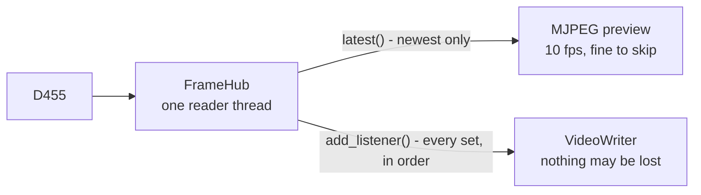

# Design

Recording an Intel RealSense D455 - and, next, a ReSpeaker USB Mic Array beside
it - so that the result can be lined up afterwards, exactly, from the files.

## The one idea

Two devices with two clocks are useless together unless every measurement
carries a time on **one** axis, and that axis is written down. Everything else
here follows from that.

The axis is `CLOCK_MONOTONIC`. Not wall-clock: an NTP step during a recording
would move `CLOCK_REALTIME` underneath it, and a session whose timeline jumps
backwards halfway through cannot be repaired afterwards. Wall time is still
recorded - it is what says when the session happened - but as a series of
measured `(monotonic, realtime)` pairs rather than as the axis itself.

| Source | What it hands out | How it reaches the axis |
|---|---|---|
| D455 frames | epoch milliseconds (`global_time`) | minus the clock offset measured for that frame |
| ReSpeaker audio | `inputBufferAdcTime` | already there - PortAudio's ALSA backend shares its origin |
| Direction (DOA) | `time.monotonic()` | already there |

## Module boundaries

Everything lives under one package, `rrr`. Dependencies run one way:
`rrr.timeline` imports nothing but numpy, `rrr.video` and `rrr.audio` import no
web framework, and nothing below `rrr.server` knows HTTP exists.



`rrr/timeline/` being the base, and importing nothing that needs a device, is the
point: it holds the arithmetic everything else depends on, so all of it can be
tested without a camera attached. If that arithmetic is wrong, nothing
downstream can detect it.

## The camera is shared, two different ways

A RealSense device admits one process. One `FrameHub` owns it and hands frames
out by two routes, because the two consumers want opposite things.



`latest()` returns the newest set, so a consumer briefly late silently misses
one. That is right for a preview and useless for a recorder. A listener is
called for every set, in order, on the hub's own thread - so it must be quick,
and `ArchiveWriter.append` is a bounded queue put of tens of microseconds.

The consequence worth having: **arming a recording does not restart the
pipeline.** The preview does not drop, and auto-exposure does not settle again
in the middle of what is being recorded.

## A session is a directory

Two devices with two natural formats. Forcing both into one container would mean
the audio could no longer be opened by anything that opens a WAV.

```
var/sessions/2026-09-02_15-28-36/
    session.json        the manifest: clock anchors, calibration state, errors
    video.rrdb          SQLite: frames, motion, calibration, sensor options
    audio.wav          every channel, int16, gaps filled with silence
    audio.clock.jsonl   measured capture time per block
    doa.jsonl           the array's direction estimate
    events.jsonl        marks made by whoever was recording
```

The manifest is what ties them together. Without it the directory is three
recordings sharing a folder: a WAV has no start time, and the archive's frame
times are on a clock the WAV knows nothing about.

## What it refuses to claim

`session.json`'s `calibration.offset_s` stays `null` until something measures
it. The two tracks share a clock, but the residual between a microphone and a
shutter - how long a sound takes to reach the converter, how long light takes to
reach a timestamp - is not derivable from either device's documentation. Showing
zero would assert an alignment nobody has established. The page displays
"unmeasured", and `rrr/tools/calibrate.py` is what will fill it in.

`rig` is the same shape of refusal, for space rather than time. A direction
from the array is a bearing in the array's own frame, and turning it into a ray
in the world needs to know where the array is bolted relative to the camera.
Nothing in either device knows that, so the field starts `"unset"` and is filled
in by hand. Defaulting it to identity would place every sound at the camera's
own origin - plausible-looking output from a mounting nobody wrote down.

What the block does record is `source`: `"nominal"` for values taken from how
the mount was designed, `"measured"` for values obtained from this hardware.
The two are both usable - the Aria recordings this project compares against use
nominal CAD positions for their own microphones - but they are not the same
claim, and which one a session was processed with has to survive in the file.

Alignment of depth to colour is refused in the same spirit: recordings are
**unaligned**, because resampling depth onto the colour grid cannot be undone,
destroys its correspondence with the infrared pair, and bakes one choice into a
file meant to outlast it. `depth_to_color` is recorded so any consumer can align
on the way out.

## Leaving

`video.rrdb` is shaped for recording, and nothing outside this repository should
have to know that. `rrr.tools.export` writes a session as plain files in a flat,
manifest-indexed layout, and that is the boundary: the analysis repository reads
the export and never imports this package. See decisions 17.

## Reading it back

`ArchiveSource` is a `FrameSource`, so analysis written against the live camera
reads a recording unchanged. Unlike the camera, any number of readers can work
on one archive at once. `frame_at(index, only=…)` exists for playback, which
wants one stream of one frame rather than everything in order.
