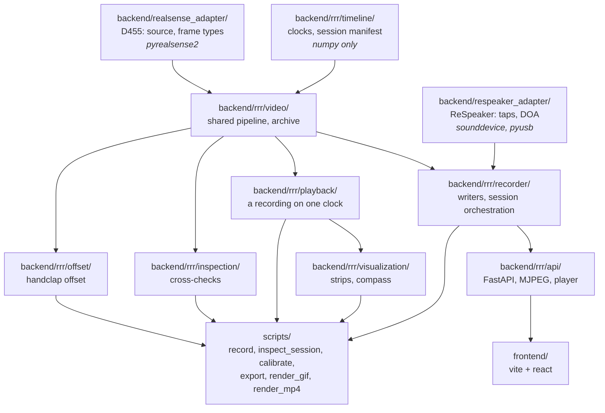
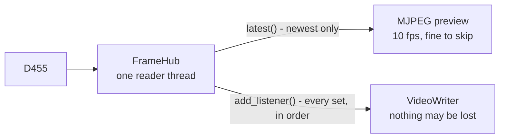

# Design

## The one idea

Two devices with two clocks are useless together unless every measurement
carries a time on **one** axis, and that axis is written down. Everything else
here follows from that.

The axis is `CLOCK_MONOTONIC`. Not wall-clock: an NTP step during a recording
would move `CLOCK_REALTIME` underneath it, and a session whose timeline jumps
backwards halfway through cannot be repaired afterwards. Wall time is still
recorded - it is what says when the session happened - but as a series of
measured `(monotonic, realtime)` pairs rather than as the axis itself.

| Source | What it hands out | How it reaches the axis |
|---|---|---|
| D455 frames | its own timestamps, kept alongside | `received_monotonic`, read when the set is assembled |
| ReSpeaker audio | `inputBufferAdcTime` | already there - PortAudio's ALSA backend shares its origin |
| Direction (DOA) | `time.monotonic()` | already there |

## Module boundaries

The recorder lives under one package, `rrr`; the two devices are reached
through `realsense_adapter` and `respeaker_adapter`, separate packages beside it
that import nothing from `rrr` and read no environment variable -
`rrr.recorder.config` chooses their settings and passes them in. Dependencies
run one way: `rrr.timeline` imports nothing but numpy, the adapters and
`rrr.video` import no web framework, and nothing below `rrr.api` knows HTTP
exists. The tools that work
on recordings - record, inspect, calibrate, export, render - are thin scripts in
`scripts/` on top of the package, and nothing in the package imports them
(decision 31). Nothing in
`rrr` opens a window either - the interface is the page in `frontend/` - which is
why OpenCV is the headless build: the full one drags in GTK, dead weight in a
container and slow to install on a Pi.


```mermaid
flowchart TD
    T["backend/rrr/timeline/<br/>clocks, session manifest<br/><i>numpy only</i>"]
    D["backend/realsense_adapter/<br/>D455: source, frame types<br/><i>pyrealsense2</i>"]
    V["backend/rrr/video/<br/>shared pipeline, archive"]
    A["backend/respeaker_adapter/<br/>ReSpeaker: taps, DOA<br/><i>sounddevice, pyusb</i>"]
    R["backend/rrr/recorder/<br/>writers, session orchestration"]
    S["backend/rrr/api/<br/>FastAPI, MJPEG, player"]
    P["backend/rrr/playback/<br/>a recording on one clock"]
    N["backend/rrr/inspection/<br/>cross-checks"]
    O["backend/rrr/offset/<br/>handclap offset"]
    Z["backend/rrr/visualization/<br/>strips, compass"]
    X["scripts/<br/>record, inspect_session, calibrate,<br/>export, render_gif, render_mp4"]
    W["frontend/<br/>vite + react"]
    T --> V
    D --> V
    V --> R
    A --> R
    R --> S
    S --> W
    V --> P
    V --> N
    V --> O
    P --> Z
    R --> X
    N --> X
    O --> X
    P --> X
    Z --> X
```

`backend/rrr/timeline/` being the base, and importing nothing that needs a device, is the
point: it holds the arithmetic everything else depends on, so all of it can be
tested without a camera attached. If that arithmetic is wrong, nothing
downstream can detect it.

Nothing under `tests/` opens a device, beyond that: the camera admits one
process at a time and the array is not much better, so a suite that needed
either could not run beside the server.

## The camera is shared, two different ways

A RealSense device admits one process. One `FrameHub` owns it and hands frames
out by two routes, because the two consumers want opposite things.


```mermaid
flowchart LR
    CAM["D455"] --> HUB["FrameHub<br/>one reader thread"]
    HUB -->|"latest() - newest only"| PRE["MJPEG preview<br/>10 fps, fine to skip"]
    HUB -->|"add_listener() - every set, in order"| REC["VideoWriter<br/>nothing may be lost"]
```

`latest()` returns the newest set, so a consumer briefly late silently misses
one. That is right for a preview and useless for a recorder. A listener is
called for every set, in order, on the hub's own thread - so it must be quick,
and `ArchiveWriter.append` is a bounded queue put of tens of microseconds.

The consequence worth having: **arming a recording does not restart the
pipeline.** The preview does not drop, and auto-exposure does not settle again
in the middle of what is being recorded.

## A session is a directory

Two devices with two natural formats. Forcing both into one container would mean
the audio could no longer be opened by anything that opens a WAV.

```
data/sessions/2026-09-02_15-28-36/
    session.json        the manifest: clock anchors, calibration state, errors
    video.rrdb          SQLite: frames, motion, calibration, sensor options
    audio.wav          every channel, int16, gaps filled with silence
    audio.clock.jsonl   measured capture time, once a second and at every gap
    doa.jsonl           the array's direction estimate
    events.jsonl        marks made by whoever was recording
    export/             derived: scripts/export.py's neutral copy
    review.mp4          derived: scripts/render_mp4.py's review movie
```

The derived entries are written only when asked for, and nothing reads them
back; they live here so that deleting a session deletes them too.

The manifest is what ties them together. Without it the directory is three
recordings sharing a folder: a WAV has no start time, and the archive's frame
times are on a clock the WAV knows nothing about.

## What it refuses to claim

`session.json`'s `calibration.offset_s` stays `null` until something measures
it. The two tracks share a clock, but the residual between a microphone and a
shutter - how long a sound takes to reach the converter, how long light takes to
reach a timestamp - is not derivable from either device's documentation. Showing
zero would assert an alignment nobody has established. The page displays
"unmeasured", and `scripts/calibrate.py` (measuring with `rrr.offset`) is what
will fill it in.

`rig` is the same shape of refusal, for space rather than time. A direction
from the array is a bearing in the array's own frame, and turning it into a ray
in the world needs to know where the array is bolted relative to the camera.
Nothing in either device knows that, so the field starts `"unset"` and is filled
in by hand. Defaulting it to identity would place every sound at the camera's
own origin - plausible-looking output from a mounting nobody wrote down.

What the block does record is `source`: `"nominal"` for values taken from how
the mount was designed, `"measured"` for values obtained from this hardware.
The two are both usable - the Aria recordings this project compares against use
nominal CAD positions for their own microphones - but they are not the same
claim, and which one a session was processed with has to survive in the file.

Alignment of depth to colour is refused in the same spirit: recordings are
**unaligned**, and `depth_to_color` is recorded so any consumer can align on the
way out (decision 2).

## Leaving

`video.rrdb` is shaped for recording, and nothing outside this repository should
have to know that. `scripts/export.py` writes a session as plain files in a
flat, manifest-indexed layout, and that is the boundary: the analysis repository
reads the export and never imports this package. The layout lives only in that
script and in `scripts/validate_export.py`, which imports nothing from `rrr`;
the package supplies the reading (`rrr.playback`) and not the format. See
[export-format.md](export-format.md) and decisions 17.

## Reading it back

`ArchiveSource` is a `FrameSource`, so analysis written against the live camera
reads a recording unchanged. Unlike the camera, any number of readers can work
on one archive at once. `frame_at(index, only=…)` exists for playback, which
wants one stream of one frame rather than everything in order.
