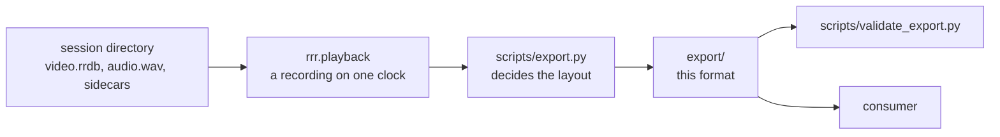

# Export format

The neutral layout a recording is converted to before it leaves this
repository. A consumer reads this and nothing else; it never imports `rrr`, and
`rrr` knows nothing of this layout either.

| | |
|---|---|
| Name | `rrr-export` (`manifest.json` `format`) |
| Version | `2` (`manifest.json` `format_version`) |
| Written by | `scripts/export.py` |
| Checked by | `scripts/validate_export.py` - stdlib, numpy and OpenCV only, so a consumer can copy it |
| Why it looks like this | `docs/decisions.md` 17 |

This file describes the format; the two scripts are what define it, and they
change together with this page. A reader should check `format` and
`format_version` before anything else. The version is bumped when the layout
changes in a way a reader must know about.



## Layout

```
export/
    manifest.json     the index: every stream, what it holds, where it is
    calibration.json  every sensor, every transform, and what is still unknown
    color/            index.csv + data/<sample>.png (or .jpg)
    ir_left/          index.csv + data/<sample>.png
    ir_right/         index.csv + data/<sample>.png
    depth/            index.csv + data/<sample>.png   16-bit, raw z16
    frame_metadata/   index.jsonl
    imu_accel/        index.csv
    imu_gyro/         index.csv
    audio/            audio.wav + clock.csv + clock_fit.json
    doa/              index.csv
    events/           index.csv
    derived/          empty: where whatever is computed from this goes
```

A stream that was not recorded, or that has no samples in the exported range,
is absent - from the directory and from `manifest.json` alike. Never walk the
directory to find out what a session holds; read `streams`.

Four properties hold throughout:

1. **Names are roles, not numbers.** `ir_left` does not move when `ir_right`
   goes away.
2. **`manifest.json` answers what a session holds.**
3. **Every sampled stream has a time-bearing index**, plus `data/` when its
   samples are files.
4. **Anything variable-length is an array, not a layout.** Eight microphones
   instead of four is a longer list, not a new directory.

## Time

Every `t_ns` is an integer number of nanoseconds on the recording host's
`CLOCK_MONOTONIC`, the one axis both devices were placed on while recording.
Image indexes additionally keep each sensor's own timestamp and what the SDK
said it means (`timestamp_domain`), unconverted.

The measured offset between the array and the camera is **not applied** to any
time in the export. It is carried in `calibration.json` `time_offset_s`: add
`value` to an audio time to reach the video time of the same instant. When it
is unmeasured, `value` is null and `notes` says so.

## `manifest.json`

| Key | Meaning |
|---|---|
| `format`, `format_version` | `"rrr-export"`, `2` |
| `session_id` | The recording's name |
| `clock_reference`, `time_unit` | `"CLOCK_MONOTONIC"`, `"ns"` |
| `started_at`, `stopped_at` | Host clock pairs (`monotonic`, `realtime`, `uncertainty`) at the edges, or null |
| `duration_s` | As the recorder measured it |
| `source.frames` | `start`, `end`, `stride` - the image-frame positions asked for |
| `source.time_range` | `start_t_ns`, `end_t_ns` - the half-open interval they cover; null for an untrimmed side |
| `source.color_encoding` | `"png"` or `"jpeg"` |
| `source.recorder`, `source.session`, `source.exported_at` | Provenance |
| `streams` | One entry per stream present, keyed by role; see below |
| `notes` | Everything known to be unknown, in words |

### Stream entries

Every entry has a `kind`; paths are relative to the export directory.

| `kind` | Streams | Entry keys |
|---|---|---|
| `image` | `color`, `ir_left`, `ir_right`, `depth` | `index`, `data`, `count`, `encoding` (`png`, `jpeg`, `png16`), `pixel` (`rgb8`, `y8`, `z16`) |
| `metadata` | `frame_metadata` | `index` (JSONL), `count`, `key` (`"group_id"`) |
| `samples` | `imu_accel`, `imu_gyro`, `doa` | `index`, `count`, `columns`; `units` for inertial, `source` for DOA |
| `audio` | `audio` | `file`, `rate`, `channels`, `samples`, `source_samples` (`start`, `end` in the original WAV), `clock` (null without a usable clock), `clock_points`, `fit` (absent without a usable clock) |
| `marks` | `events` | `index`, `count`, `columns`, `note` |

### Index columns

| Stream | Columns |
|---|---|
| images | `sample_id`, `group_id`, `t_ns`, `sensor_timestamp_ms`, `timestamp_domain`, `file` |
| `imu_accel`, `imu_gyro` | `t_ns`, `x`, `y`, `z` (m/s^2, rad/s) |
| `doa` | `t_ns`, `angle_deg`, `voice` |
| `events` | `t_ns`, `label`, `data` (a JSON object) |
| `audio/clock.csv` | `sample`, `t_ns`, `filled` |

- `sample_id` counts from zero without gaps within a stream and names the file
  (`data/000000042.png`). Not `t_ns`: two frame sets can share a host time, and
  one image must never replace another.
- `group_id` is the archive's frame-set id, shared by the images captured
  together and by the matching `frame_metadata` line, which holds the variable
  firmware fields per stream.
- Colour is RGB, never packed YUYV. Depth is raw z16; multiply by
  `calibration.json` `sensors.depth.scale_m` for metres. Zero means no
  measurement, not zero distance.
- The two inertial streams are separate tables at their own rates; joining them
  would mean resampling one.
- `doa` is the array's own firmware estimate, in the array's frame: 0 deg is the
  array's +Y, increasing clockwise toward +X.
- `events` are marks made by hand while recording, late by a reaction time. They
  say what a stretch was; they are not instants to align against.
- `audio/audio.wav` keeps every channel, int16, uncompressed, with dropped audio
  already replaced by silence. `clock.csv` places sample numbers on the
  monotonic clock (`filled` is the silence inserted before that point), and
  `clock_fit.json` is the straight-line fit through it. A recording whose clock
  sidecar is empty or unreadable is still exported whole: `clock` is null,
  `clock_points` is 0, there is no `fit`, and `notes` says the samples cannot be
  placed in time. A reader must check `clock` before relying on audio times.

## `calibration.json`

| Key | Meaning |
|---|---|
| `reference_frame` | `"depth"`: every transform is expressed against the depth stream's frame (the left imager on a D400) |
| `sensors` | Per role: `intrinsics` for images (with `width`, `height`), `scale_m` for depth, `motion_intrinsics` for inertial |
| `extrinsics` | A list of `{from, to, rotation, translation}`, each naming both ends; rotation is row-major 3x3, translation in metres |
| `infrared_baseline_m`, `aligned_to_color` | As the device reported them |
| `device` | The camera: `name`, `serial`, `firmware`, `usb_type` |
| `array` | The microphone array: `source`, `microphones`, `channels`, `to_depth`, `description`, `note` |
| `time_offset_s` | `value`, `uncertainty_s`, `method`, `note` - see Time |

An unmeasured transform is **null, not an identity**. While the mounting between
the array and the camera is `"unset"`, `array.to_depth` and the microphone
positions are null and `notes` says a direction cannot be placed in the camera's
frame.

## Partial exports

`--start` and `--end` choose image-frame positions; the half-open host-clock
interval they span (`source.time_range`) crops the audio, inertial samples, DOA
and marks too. `--stride` decimates images only. A cropped WAV gets clock points
rebased to its own sample zero, interpolated at both edges. A trimmed export
needs a usable audio clock; without one the conversion is refused rather than
guessed.

## What the validator checks

`scripts/validate_export.py <export>` exits 0 and prints `OK`, or lists each
problem and exits 1. Every export is validated before it is moved into place,
so a failed conversion never leaves a plausible partial result. It checks,
from the files alone:

- `format` and `format_version`, and that both JSON files are objects
- every path a stream names exists
- each index's row count matches `count`, and `t_ns` never goes backwards
- image `sample_id`s are contiguous from zero, filenames are unique, every file
  exists, and the first decodes with the dtype `pixel` implies and the size
  `calibration.json` gives
- the WAV's rate, channels and length match the entry; and when `clock` is not
  null, its clock points are increasing, never go backwards in time, and stay
  inside the file - when it is null, no clock points may be claimed
