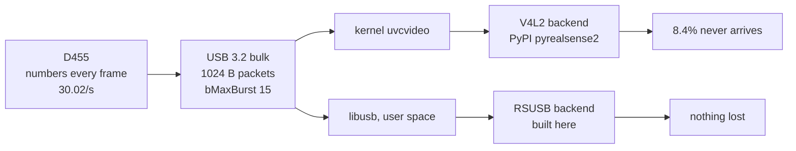

# Where the frames were going

A D455 asked for 1280x720 depth at 30 fps delivered 91.6% of them. The camera
numbered every frame it made, so the missing ones were made and never arrived.
This is the record of finding out why, because the answer was not any of the
first four things it looked like.

Everything below is measured on this machine: Ubuntu 24.04, kernel 6.17,
i9-11900K, D455 serial 311322302077 on firmware 5.17.3.10, librealsense 2.58.3.

## The symptom

Frame numbers are assigned by the camera. A gap in them means a frame the
camera produced never reached the process. Twenty seconds of 848x480/30:

```
depth  numbers 5..574 span 570  delivered 546  MISSING 24  redelivered 21
color  numbered 15..584 span 570  delivered 567  MISSING  3  redelivered  0
```

Depth lost 4.2%; colour lost 0.5%. The `redelivered` column is the SDK's
response to a missing depth frame: its syncer pairs the previous one with the
next colour frame, so a set still arrives, with its two streams 33.4 ms apart
instead of 0.03 ms. Those sets are discarded here - a set whose depth is one
frame older than its colour is not a moment in time - which is why the effective
rate was 28.7 fps rather than 30.

## What it was not

Each of these was measured, not reasoned about.

| Hypothesis | Verdict | The measurement that settled it |
|---|---|---|
| USB bandwidth | **No** | RSUSB carried 172 MB/s with nothing lost; V4L2 lost frames at 106 MB/s |
| CPU too slow | **No** | 0.5% of one core while streaming, of sixteen |
| Payload size | **No** | RSUSB loses nothing at 1843 KB/frame |
| Transfer rate | **No** | 1280x720 lost 8.8% at 30 fps and **19.7% at 5 fps** |
| Auto-exposure | **No** | Fixed at 4 ms: 14.0% and 15.1% on repeat, unchanged |
| `usbfs_memory_mb = 16` | **Irrelevant** | The process had `/dev/video0-3` open, so nothing went through usbfs |
| USB3 link power management | **No** | U1 enabled throughout, and RSUSB lost nothing with it on |
| Cable, port, hub, the array | **No** | Same hardware either way; the array is on a different controller |

The rate result is the one that ruled out every bandwidth-shaped explanation.
Dropping to a sixth of the data made the loss **worse**, which no theory about
throughput survives.

## What it was

The backend. Same camera, same cable, same machine, same librealsense version -
only the transfer path differs.

| Backend | Configuration | depth lost | colour lost | Throughput |
|---|---|---|---|---|
| **V4L2** (the PyPI wheel) | depth 1280x720 + colour 1280x800 @30 | **8.4%** | **9.6%** | 106 MB/s |
| **RSUSB** (libusb) | same | **0.0%** | **0.0%** | 117 MB/s |
| **RSUSB** | same **+ both raw IR** @30 | **0.0%** | **0.0%** | **172 MB/s** |

```
depth 1280x720 + colour 1280x800 + IR1 + IR2 @ 30, 20 s   [RSUSB]
  depth      1843 KB/frame  numbers 30.02/s  delivered 30.02/s  MISSING 0/510
  color      2048 KB/frame  numbers 30.02/s  delivered 30.02/s  MISSING 0/510
  IR 1        922 KB/frame  numbers 30.02/s  delivered 30.02/s  MISSING 0/510
  IR 2        922 KB/frame  numbers 30.02/s  delivered 30.02/s  MISSING 0/510
```



The endpoint is **bulk**, 1024-byte packets with `bMaxBurst 15`, so USB's own
retries are in play and this is not packet loss. Frames were arriving late and
being discarded by the driver, not corrupted in transit. `dmesg` recorded no USB
errors.

**Why this went unnoticed for so long:** `pyrealsense2` on PyPI is built against
V4L2. realsense-playground builds `realsense-viewer` with
`-DFORCE_RSUSB_BACKEND=true` but installs the wheel for Python, so the viewer
looked smooth while anything written in Python dropped 8% of its frames.

## What the sensors actually are

Worth writing down, because a widely-repeated claim about this camera turned out
to be wrong.

```
=== Stereo Module ===          two IR cameras; depth is computed from them
  Infrared 1 (y8)   1280x800 at [30, 15]
  Infrared 2 (y8)   1280x800 at [30, 15]
  Depth (z16)       1280x720 at [30, 15, 5]      <- 80 lines short of the sensor
=== RGB Camera ===             a separate sensor in the middle
  Color (yuyv)      1280x800 at [30, 15, 10, 5]
=== Motion Module ===
  Accel   400 / 200 / 100 Hz
  Gyro    400 / 200 Hz
```

| Sensor | Native | Max fps | fx | FOV |
|---|---|---|---|---|
| IR left / right | **1280x800** | 30 (y8), 25 (y16) | 653.36 | 88.8 x 63.0° |
| RGB | **1280x800** | 30 | 643.59 | 89.7 x 63.8° |

Depth tops out at 1280x720 - a limit of the depth processor, not the sensors.
Stereo baseline 95.13 mm, recorded in every archive rather than assumed.

### 848x480 is not a native mode

realsense-playground's notes say "the D455's native depth resolution", and
"asking for anything else makes the firmware scale internally". The intrinsics
say otherwise:

```
IR 1 (raw sensor)  1280x800  fx=653.36  ppy=398.66  FOV 88.8 x 63.0
Depth              1280x720  fx=653.36  ppy=358.66  FOV 88.8 x 57.7
Depth               848x480  fx=432.85  ppy=239.11  FOV 88.8 x 58.0
Depth               640x480  fx=392.02  ppy=239.20  FOV 78.4 x 63.0
Depth               640x360  fx=326.68  ppy=179.31  FOV 88.8 x 57.7
```

| Output | How it is made |
|---|---|
| 1280x720 | 1280x800 cropped vertically. `fx` unchanged, `ppy` exactly 40 lower |
| **848x480** | scaled by 0.6625 (653.36 x 0.6625 = 432.85 = 848/1280), then cropped |
| 640x480 | scaled by 0.6, then cropped **horizontally** - so the field of view changes |
| 640x360 | scaled by 0.5 (653.36 x 0.5 = 326.68), then cropped vertically |

So 848x480 and 640x360 are equally derived. There is no sense in which 848x480
is closer to the sensor; it is only larger. And **640x480 should be avoided**:
its horizontal field of view is 10.4° narrower and its vertical 5° wider,
because it is a different crop rather than a smaller version of the same image.

## Falling back, if RSUSB is ever unavailable

Measured through V4L2, in case a platform cannot use libusb. Loss rises with
frame size but not smoothly, and 1280x720 is where colour starts suffering too.

| Configuration | depth | colour | Effective fps |
|---|---|---|---|
| 1280x720 @30 | 11.2% | 11.6% | 26.7 |
| 848x480 @60 | 3.3% | 0.1% | 57.9 |
| 848x480 @30 | 4.3% | 0.7% | 28.8 |
| 848x480 @15 | 2.8% | 0.0% | 14.7 |
| 640x480 @30 | 0.0% | 0.0% | 29.5 |
| **640x360 @30** | **0.2%** | 0.0% | **30.0** |
| 480x270 @30 | 0.0% | 0.0% | 30.1 |
| 424x240 @30 | 0.0% | 0.0% | 30.1 |

On V4L2 the best full-field-of-view choice is **640x360@30**: same 88.8° as
848x480, effectively no loss, at the price of 1.33x the depth noise (error goes
as 1/fx, so 6 mm at 1.5 m becomes 8 mm).

Raw IR through V4L2 is worse than either, and reproducibly so - 14.0% and 15.1%
at 1280x800 against 0.7% and 1.5% at 1280x720, with exposure fixed. Whatever the
threshold is, 1280x800 is on the wrong side of it.

## What is still discarded, on purpose

Two or three sets per recording, always within the same millisecond as
`pipeline.start`:

```
04:31:38,724  discarding a set whose streams are 129.4 ms apart: {'color': 2, 'depth': 7, ...}
04:31:38,724  discarding a set whose streams are 196.3 ms apart: {'color': 4, 'depth': 7, ...}
04:31:38,792  discarding a set whose streams are 229.8 ms apart: {'color': 6, 'depth': 1, ...}
        <- nothing for the remaining ten seconds
```

The syncer settling: one stale depth frame paired with successive colour frames,
after which the depth counter restarts at 1. Counted as `skipped_warmup` rather
than as a loss, because the frames that follow are provably continuous - four
recordings checked, `MISSING 0` on both streams every time.

## Where it ended up

```
session 2026-09-02_06-28-36                    [Docker / RSUSB / SATA SSD]
  video           1010 frames over 33.67 s = 29.97 fps
  frame interval  33.4 ms median, 33.4 min, 33.5 max
  arrival lag     16.8 ms median (12.7 to 22.5)
  depth  1010 frames, MISSING 0
  color  1010 frames, MISSING 0
```

An interval that varies by 0.1 ms, where V4L2 left 100 ms holes.
